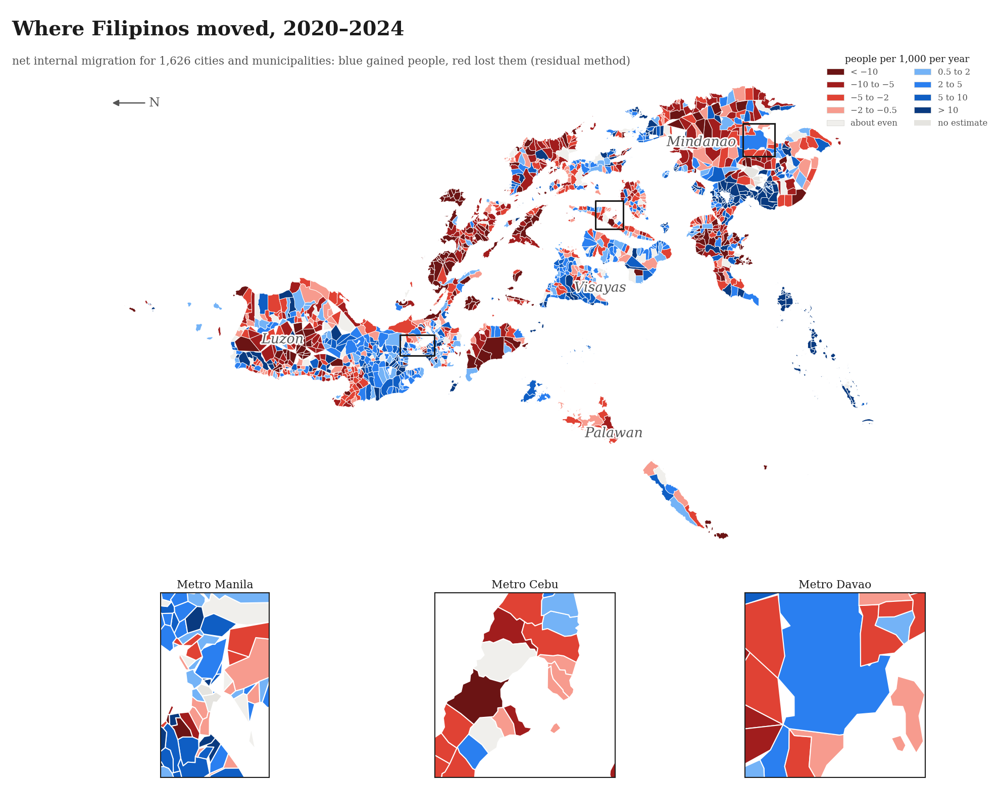
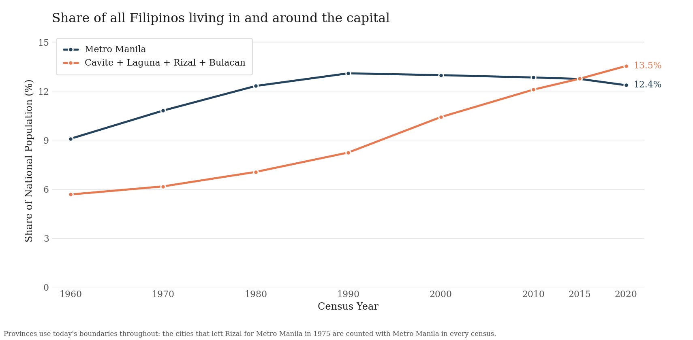
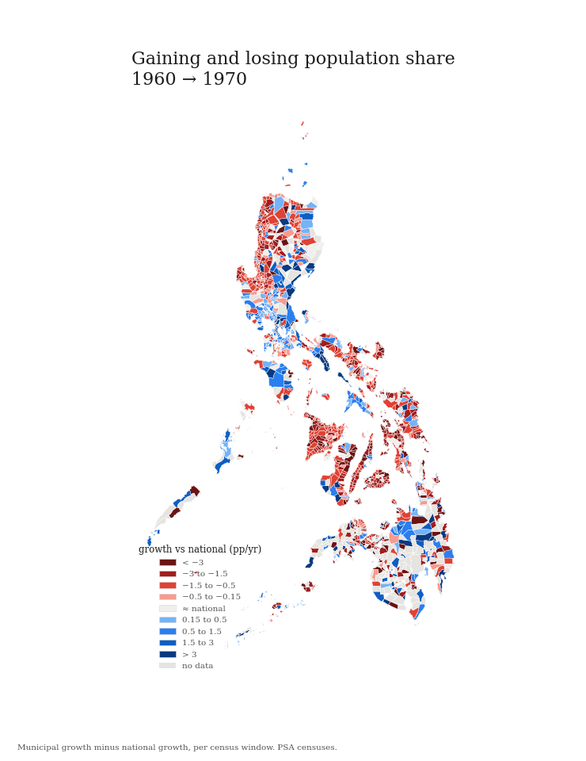

# Philippine Internal Migration Dataset

**Site and interactive map:** https://daviddemitriafrica.github.io/philippines-internal-migration/



This dataset estimates how many people moved into and out of every city and
municipality in the Philippines. It is built from public government data
(PSA censuses, birth and death registration, and the PSGC), and every number
can be traced back to the file it came from. The main file covers 1,626
cities and municipalities for 2020 to 2024. Provinces are covered for 2015
to 2020 and 2020 to 2024. The data is ODbL and the code is MIT.

## The files (data/clean/)

| File | What it is |
|---|---|
| `municipal_master.csv` | **Start here.** One row per town and city with its census populations 1960 to 2024, its registered births and deaths 2017 to 2024, and its migration estimate |
| `net_migration_municipal_2020_2024.csv` | Net migration for 1,626 towns and cities, 2020 to 2024, with caveat flags |
| `net_migration_province.csv` | Net migration by province and large city, for 2015 to 2020 and 2020 to 2024 |
| `population_census_municipal.csv` | Every town's population in the 8 censuses from 1960 to 2020, checked across two PSA publications |
| `population_barangay_2020.csv` | All 42,041 barangays with their 2020 population. 35,634 of them also have a verified 2010 value |
| `population_barangay_2010.csv` | Barangay populations from the 2010 census, pulled out of archived regional PDFs and checked town by town |
| `vital_statistics_municipal.csv` | Registered births and deaths per town, 2017 to 2024 |
| `vital_statistics_provincial.csv` | Registered births and deaths per province, 2006 to 2024 |
| `municipalities.csv` | The reference list of 1,642 towns and cities |
| `psgc_changes.csv` | 4,688 boundary and name changes since 1977 |
| `proxy_mayor_votes_municipal.csv` | Mayoral votes per town per election, 2016 to 2025. A weak migration proxy, see the codebook |
| `atlas/` | Ranked tables of the largest gains and losses, and event tables for Haiyan and Marawi |

`data/CODEBOOK.md` explains every column and every known gap. Nothing is
interpolated. Where a source is missing, the value is empty and a flag says
why.

## How to rebuild it

```bash
python3 pipeline/run_all.py
```

This turns the raw source files into the clean dataset and prints checks
along the way. The download scripts are `pipeline/openstat.py` (PSA's
OpenSTAT API) and `pipeline/wayback.py` (psa.gov.ph files through the
Internet Archive, because psa.gov.ph blocks datacenter IPs). The PSA census
data is genuinely hard to work with. Files are scattered across publications
and formats, some exist only as PDFs, and boundaries change between
censuses. Most of the pipeline is cleaning. Every downloaded file is logged
in `data/provenance.jsonl` with its source URL, archive URL, checksum, and
retrieval time.

## What the data shows



Metro Manila's share of the national population peaked around 1990. The
four provinces around it (Cavite, Laguna, Rizal, and Bulacan) more than
doubled their share over sixty years and passed the capital between 2015
and 2020. After 2020 the capital itself flipped from losing people to
gaining them (`figures/ncr_dumbbell.png`, `figures/region_bars.png`). Six
disasters are measured against similar unaffected towns in
`figures/event_studies_forest.png`. Haiyan's population cost arrived a full
census window after the storm.



## What you could use it for

- Finding the towns that are growing because people are arriving rather
  than because of births. Those towns will need schools, clinics, housing,
  and water first.
- Measuring what a disaster did to a place's population. The census panel
  goes back to 1960, and the Haiyan and Pinatubo studies are worked
  examples.
- Testing whether public works change where people move. The data joins to
  any spending or project dataset through PSGC codes. We are using it to
  study the economic impacts of flood control projects.
- Checking global population models. WorldPop and similar products publish
  modeled migration estimates for the Philippines, and this is census-based
  data to check them against.
- Measuring change at the barangay level. 35,634 barangays have verified
  2010 and 2020 populations, the smallest units in the country where change
  can be measured.

## Citing this dataset

```bibtex
@misc{africa2026philippinemigration,
  author = {Africa, David Demitri},
  title  = {Philippine Internal Migration Dataset},
  year   = {2026},
  url    = {https://github.com/DavidDemitriAfrica/philippines-internal-migration},
  note   = {Net internal migration estimates for every Philippine city and
            municipality, built from public PSA data}
}
```
